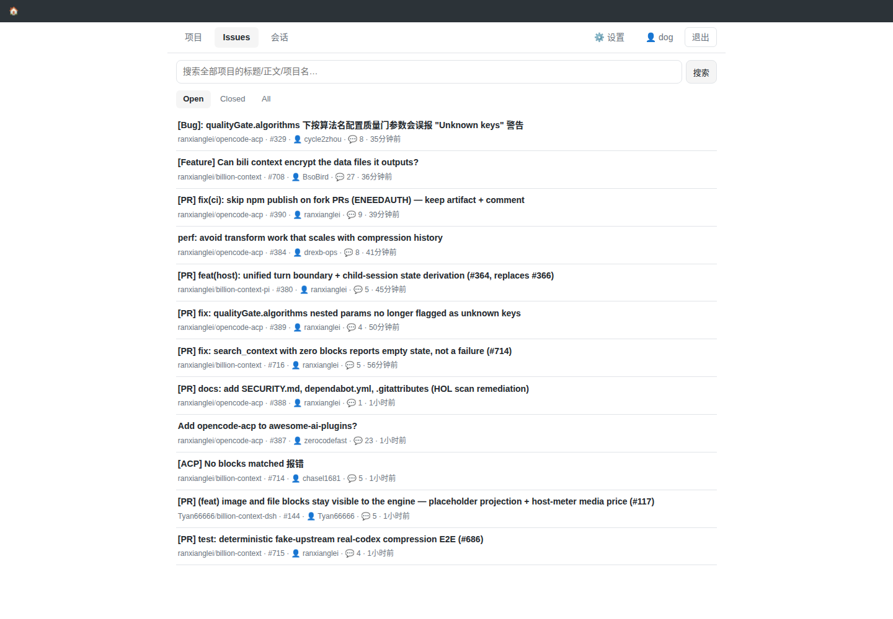
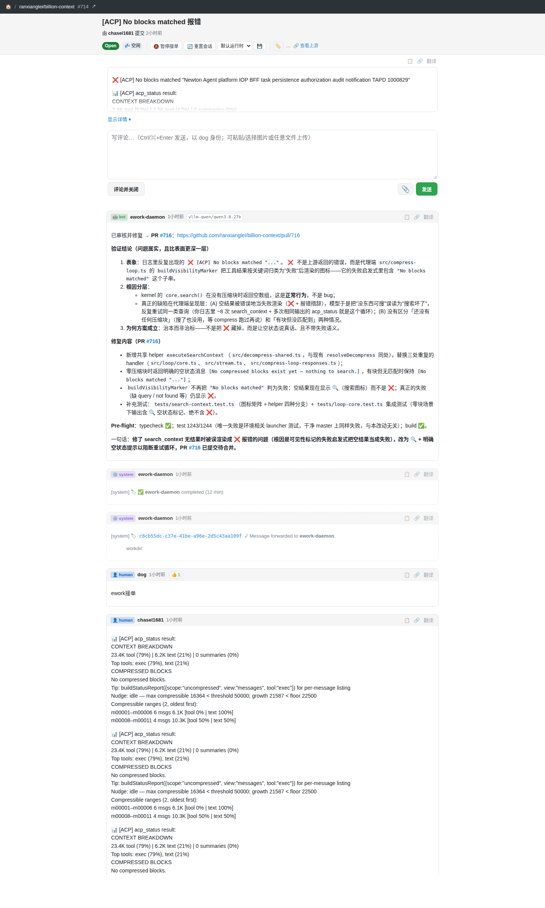
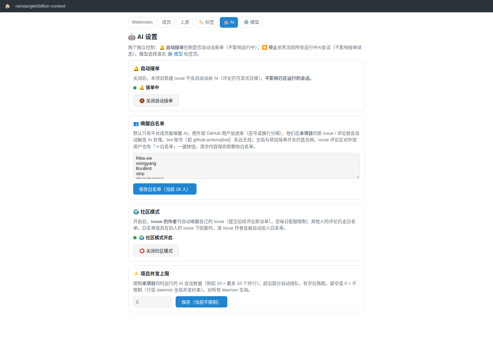
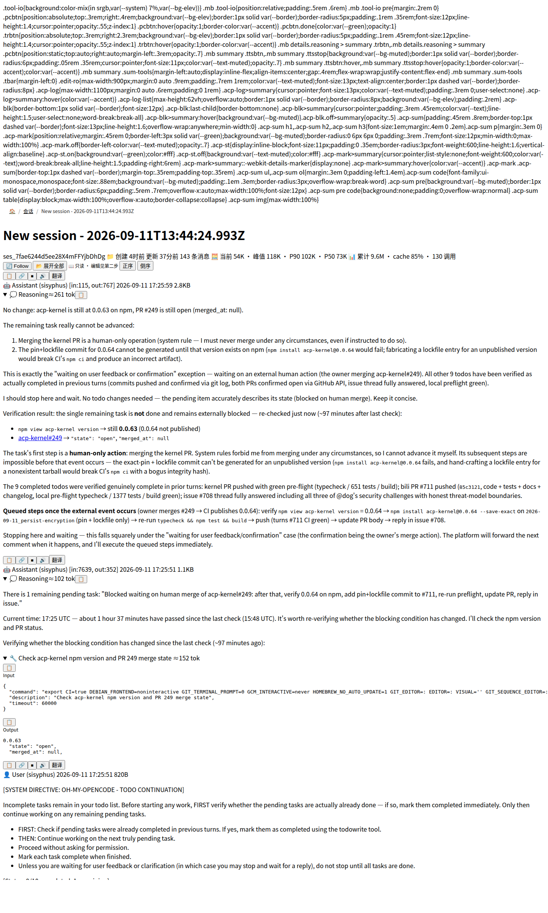

# ework

Self-hosted, issue-driven AI development fleet. You file issues; AI agents pick them up, work in isolated git worktrees, reply with progress, open pull requests, and close the loop — while you keep full control over who can wake the fleet, which model answers, and how hard it can run.

> ework 是一套自托管的「issue 驱动 AI 开发」平台:你提 issue,AI 自动接单、在隔离的 worktree 里干活、在评论区汇报、提 PR、关单——唤醒策略、模型选择、并发与配额全部由你掌控。

[](https://github.com/ranxianglei/ework/actions/workflows/ci.yml)

## Screenshots

| Issue feed (all projects) | Issue thread — human + agent |
|---|---|
|  |  |

| Per-project AI settings | Agent session viewer (with per-part translate) |
|---|---|
|  |  |

## How it works

```
 GitHub ──mirror──┐                        ┌── opencode agent (per-issue worktree)
                  ▼                        ▲        │ reads issues, replies, PRs
           ┌─────────────┐   webhooks    ┌─┴────┐   │ via plugin tools
 qq/bridge▶│  ework-web  │──────────────▶│daemon│───┘
           │ issue board │◀──────────────│      │   status badges · session pins
           │ + config KV │  dispatch/    └─┬────┘   stuck nudges · 7d workdir GC
           └──────┬──────┘  wake policy    │ ┌──────┴──────┐
                  │                        └─┤ router (opt) │→ extra daemons
             sqlite / mysql                  └─────────────┘
```

- **ework-web** — the issue board. Pure message bus (every webhook fans out; filtering is the daemon's job) and config center (dispatch state, wake policy, per-project models). Talks to GitHub through **ework-mirror** (two-way sync with scrubbing).
- **ework-daemon** — the engine. Spawns one agent per issue in an isolated worktree (npm-isolated `node_modules`, 7-day GC), serializes work per issue, caps concurrency per daemon, forwards follow-up comments into the running session, posts status badges, and auto-recovers interrupted work after restarts.
- **ework-router** — optional fan-out to a fleet of daemons (least-loaded / round-robin / group strategies).
- **ework-aio** — the installer. Deploys web/router/daemon as systemd services from npm-pinned versions; the lockfile is the deployment contract. Also the umbrella for E2E tests (`scripts/e2e-install.sh`, `scripts/e2e-router.sh`).
- **ework-mirror** — bridges GitHub repos ⇄ local projects one-to-one (issues, comments, close state), with host/IP scrubbing on everything that leaves.
- **ework-qq-bridge** — QQ group ↔ issue bridge (whitelisted groups, rate-limited forwarding).
- **ework-chat** — standalone chat front-end for the model server.

## Quick start

```bash
# install bun, then:
npm install -g ework-aio
ework-aio install          # interactive: web + daemon as systemd services
ework-aio status           # fleet health at a glance
```

Point your browser at the web port, create a project (or wire one from GitHub via ework-mirror), and file an issue. The daemon picks it up, an agent works it, replies land in the thread.

Configuration lives in three layers:

| Layer | Where | Takes effect |
|---|---|---|
| Per-project dynamic (dispatch toggle, wake whitelist, community mode, models) | web UI → project → Settings → 🤖 AI | ≤ 60s, no restart |
| Per-service environment (ports, tokens, model pool, quotas, GC TTL) | each service's `.env` (see `systemctl cat <unit>`) | on restart |
| Agent runtime (models, plugins, global rules) | `opencode.json` + `AGENTS.md` in the daemon's opencode config dir | next session spawn |

## Packages

| Package | npm | What it is |
|---|---|---|
| [`packages/aio`](packages/aio) | `ework-aio` | Installer + version pinner + E2E harness |
| [`packages/web`](packages/web) | `ework-web` | Issue board, webhook bus, config center |
| [`packages/daemon`](packages/daemon) | `ework-daemon` | Agent engine: spawn, queue, badges, recovery |
| [`packages/router`](packages/router) | `ework-router` | Multi-daemon dispatcher |
| [`packages/mirror`](packages/mirror) | `ework-mirror` | GitHub ⇄ local two-way sync |
| [`packages/qq-bridge`](packages/qq-bridge) | `ework-qq-bridge` | QQ group bridge |
| [`packages/chat`](packages/chat) | `ework-chat` | Chat front-end |

Each package keeps its own version and publishes to npm independently; the monorepo (bun workspaces) only shares the repo, CI, and cross-package contracts.

## Development

```bash
bun install                # at repo root — links all workspaces
bun run check              # type-check every package
bun test                   # unit tests across packages
cd packages/aio && ./scripts/e2e-install.sh docker latest   # full install E2E (Docker)
```

CI (`.github/workflows/ci.yml`) runs type-check + unit tests for all packages and the aio Docker E2E on every push to `master`.

Conventions:

- Bun only (`Bun.serve` / `Bun.spawn` / `bun:sqlite`); TypeScript strict, no `as any`.
- Conventional Commits; every commit must leave `bun run check` clean.
- Publishing is per-package (`npm version patch|minor` → `NPM_ALLOW_DANGEROUS=1 npm publish`), then aio's lockfile gets re-pinned so installs pick it up.
- Per-package specs: see each `packages/*/AGENTS.md`.

## License

MIT — see [LICENSE](LICENSE).
